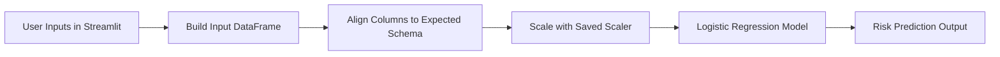

<!-- ===========================
     HEART DISEASE PREDICTION - ADVANCED README
     Repo: gaurav-singh-tech/HEART_DISEASE-DETECTION-----PROJECT
     =========================== -->

<div align="center">


<p align="center">
  
  
  
  
  
</p>

<p>
  <a href="https://heartdisease-detection-madeby-gaurav-singh-bisht.streamlit.app/">
    
  </a>
  <a href="#-how-it-works">
    
  </a>
  <a href="#-how-to-run-locally">
    
  </a>
</p>

<p>
  <b>Author:</b> Gaurav Singh Bisht
  <br/>
  <sub>“Turning data into life‑saving decisions — one prediction at a time.”</sub>
</p>

<p>
  
</p>

</div>

---

## ✨ Project Overview
This project delivers a **heart disease risk prediction app** that transforms clinical inputs (age, cholesterol, ECG, exercise angina, etc.) into a clear prediction:

- ✅ **Heart Disease Detected**  
- ✅ **No Heart Disease Detected**

It includes:
- A complete ML workflow (EDA → preprocessing → training → evaluation)
- Model & preprocessing persistence (`.pkl`)
- A production‑style Streamlit UI designed for human-friendly inputs

---

## 🚀 Live App (original link kept exactly)
👉 https://heartdisease-detection-madeby-gaurav-singh-bisht.streamlit.app/

---

## 🧭 Table of Contents
- [Why this project](#-why-this-project)
- [Dataset](#-dataset)
- [How it works](#-how-it-works)
- [Architecture](#-architecture-high-level)
- [Tech stack](#-tech-stack)
- [Artifacts](#-artifacts)
- [Run locally](#-how-to-run-locally)
- [Limitations](#-limitations--disclaimer)
- [Contact](#-contact)

---

## 🎯 Why This Project
Heart disease prediction is a classic applied ML problem — the real challenge is not only training a model, but delivering it as a **usable tool**.

This project emphasizes:
- End‑to‑end ML delivery (not “just a notebook”)
- Clean UX (sliders, dropdowns) instead of confusing raw numeric encodings
- Robustness (handling expected model columns and consistent scaling)

---

## 📊 Dataset
From the included dataset file: `heart (1).csv`

**Shape:** ~918 rows × 12 columns  
Key fields used:
- Age, Sex, ChestPainType
- RestingBP, Cholesterol, FastingBS
- RestingECG, MaxHR, ExerciseAngina
- Oldpeak, ST_Slope  
Target:
- `HeartDisease` (0/1)

---

## ⚙️ How It Works
### ML + App Inference Pipeline
1. User provides health indicators via Streamlit UI
2. Input is assembled into a DataFrame
3. Missing expected columns are safely filled (for stability)
4. Data is aligned to the training feature order
5. Scaler transforms features
6. Logistic Regression predicts risk class

---

## 🏗️ Architecture (High Level)



---

## 🧰 Tech Stack
<div align="center">


</div>

---

## 📦 Artifacts
| File | Role |
|------|------|
| `logistic_heart_disease_model.pkl` | Trained classifier |
| `scaler.pkl` | Feature scaler used during training |
| `logistic_columns_heart.pkl` | Expected feature schema (column order) |

These artifacts ensure **reproducible predictions** and prevent training/inference mismatch.

---

## 📁 Repository Structure
| File | Purpose |
|------|---------|
| `ML_PROJECT_2,_HEART.ipynb` | EDA + preprocessing + model training |
| `app.py` | Streamlit web app |
| `heart (1).csv` | Dataset |
| `logistic_heart_disease_model.pkl` | Saved model |
| `scaler.pkl` | Saved scaler |
| `logistic_columns_heart.pkl` | Expected feature columns |
| `requirements.txt` | Dependencies |

---

## 🧪 How to Run Locally

### 1) Install dependencies
```bash
pip install -r requirements.txt
```

### 2) Run the Streamlit app
```bash
streamlit run app.py
```

---

## 🧠 Mini Mindmap (1‑minute Recruiter Scan)
```text
Heart Disease Prediction
├── Data
│   └── 918 rows, clinical features + target label
├── Prep
│   ├── Encoding categorical variables
│   ├── Scaling numeric features
│   └── Persisting schema + scaler
├── Model
│   └── Logistic Regression (interpretable baseline)
├── Deployment
│   └── Streamlit UI for real-time predictions
└── Reliability
    └── Column alignment to avoid inference mismatch
```

---

## ⚠️ Limitations & Disclaimer
- This is a **learning + demonstration project** and not a medical device.
- Predictions should **not** be used as medical advice.
- Real clinical deployment would require:
  - extensive validation, bias checks, calibration
  - clinical review and regulatory compliance

---

## 📈 Optional Dynamic Widgets (Developer Branding)
<div align="center">
  
  
</div>

---

## 🤝 Contact
Replace placeholders:
- **GitHub:** https://github.com/gaurav-singh-tech  
- **LinkedIn:** https://www.linkedin.com/in/<your-link>/  
- **Email:** <your-email>  

<div align="center">

### ⭐ If you like this project, consider starring the repo!

</div>
